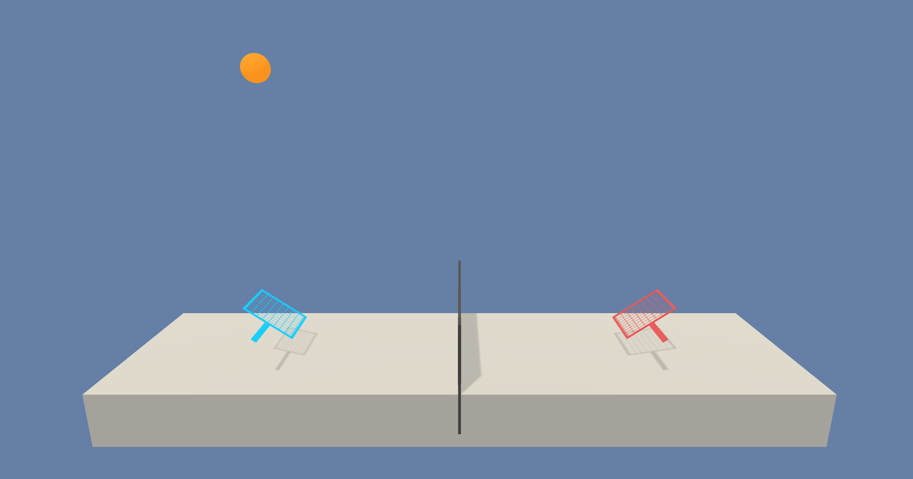

# Collaboration and Competition

## Project Details

This project utilizes Unity ML [Tennis environment](s/ml-agents/blob/main/docs/Learning-Environment-Examples.md#tennis).

In this environment, two agents control rackets to bounce a ball over a net. If an agent hits the ball over the net, it receives a reward of +0.1. If an agent lets a ball hit the ground or hits the ball out of bounds, it receives a reward of -0.01. Thus, the goal of each agent is to keep the ball in play.

The observation space consists of 8 variables corresponding to the position and velocity of the ball and racket. Each agent receives its own, local observation. Two continuous actions are available, corresponding to movement toward (or away from) the net, and jumping.

The task is episodic, and in order to solve the environment, your agents must get an average score of +0.5 (over 100 consecutive episodes, after taking the maximum over both agents). Specifically,

After each episode, we add up the rewards that each agent received (without discounting), to get a score for each agent. This yields 2 (potentially different) scores. We then take the maximum of these 2 scores.
This yields a single score for each episode.
The environment is considered solved, when the average (over 100 episodes) of those scores is at least +0.5.

## Getting Started

1. Clone [this repository](https://github.com/0Zeta/Udacity-Collaboration-and-Competition) and install the dependencies specified in the official [DRLND-repository](https://github.com/udacity/deep-reinforcement-learning#dependencies)

2. Download the environment from one of the links below.  You need only select the environment that matches your operating system:
    - Linux: [click here](https://s3-us-west-1.amazonaws.com/udacity-drlnd/P3/Tennis/Tennis_Linux.zip)
    - Mac OSX: [click here](https://s3-us-west-1.amazonaws.com/udacity-drlnd/P3/Tennis/Tennis.app.zip)
    - Windows (32-bit): [click here](https://s3-us-west-1.amazonaws.com/udacity-drlnd/P3/Tennis/Tennis_Windows_x86.zip)
    - Windows (64-bit): [click here](https://s3-us-west-1.amazonaws.com/udacity-drlnd/P3/Tennis/Tennis_Windows_x86_64.zip)
    
    (_For Windows users_) Check out [this link](https://support.microsoft.com/en-us/help/827218/how-to-determine-whether-a-computer-is-running-a-32-bit-version-or-64) if you need help with determining if your computer is running a 32-bit version or 64-bit version of the Windows operating system.

3. Place the file in this GitHub repository and unzip (or decompress) the file. Then rename the folder to `Tennis`. (Now `Tennis/Tennis.exe` should exist.)

## Instructions

Simply execute the cells in `tennis.ipynb` to get started with training the agent. 
The model weights are saved in `checkpoint_actor.pth` and `checkpoint_critic.pth`. The code for the agent is in `maddpg_agent.py` and the neural network architecture is in `model.py`. The training function is in `train_utils.py`. 