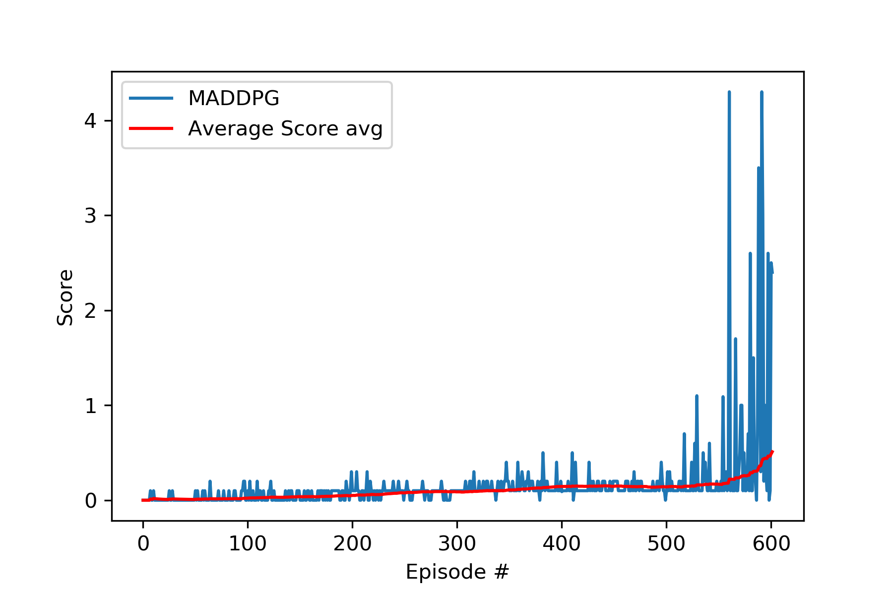

# REPORT

## Learning Algorithm

Actor-critic Multi Agent Deep Deterministic Policy Gradient [MADDPG](https://arxiv.org/abs/1706.02275) approach was used as the learning algorithm for the agent. This algorithm is based on a standard [DDPG](https://arxiv.org/abs/1509.02971) algorithm, but is adapted to solve tasks with multiple agents.


As an off-policy algorithm MADDPG utilizes four neural networks: a local actor, a target actor, a local critic and a target critic. For each training step the experience tuple from each agent is stored in the replay buffer. 

Then every training step (defined after each 5 timesteps of an episode) the agent learns from a random sample from the stored experience tuple. The actor tries to estimate the
optimal policy by using the estimated state-action values from the critic while critic tries to estimate the optimal q-value function
and learns by using a normal q-learning approach. 

Using this approach we benefit from using value-based and policy-based methods at the same time. By giving the critic access to the action of the other player the learning process gets stabilized, without requiring to give the additional information to the actor which is the only network required for acting after the agent is trained successfully.

### Ornstein-Uhlenbeck Noise

The environment doesn't have discrete actions, and we have movement with high degree freedom in magnitude and direction of performed actions.

Using a simple epilon-greedy approach to sample uniformly, we could end up with actions that have a zero mean and thus cancel each other out. This will make learning hard, or impossible as it will likely just oscillate without making any progress. To overcome this we use the Ornstein-Uhlenbeck process, as suggested in a paper by [Google DeepMind (see page 4)](https://arxiv.org/pdf/1509.02971.pdf). The Ornstein-Uhlenbeck process adds noise to the action values at each timestep. This noise is correlated to previous noise and tends to stay in the same direction for longer durations without the canceling effect.

Ornstein-Uhlenbeck process itself has three hyper-parameters that determine the noise characteristics and magnitude:

- `mu`: the long-running mean
- `theta`: the speed of mean reversion
- `sigma`: the volatility parameter

Hyperparameter values are showed below. The reduced noise volatility helped the model converge faster. An epsilon parameter was used to decay the noise level over time so that more noise is introduced earlier in the training process (i.e., higher exploration), and the noise decreases over time as the agent gains more experience.

### Hyperparameters
The following hyperparameters were used:
```
BUFFER_SIZE = int(1e6)  # replay buffer size
BATCH_SIZE = 128        # minibatch size
LR_ACTOR = 1e-3         # learning rate of the actor
LR_CRITIC = 1e-3        # learning rate of the critic
WEIGHT_DECAY = 0        # L2 weight decay
LEARN_EVERY = 5         # learning timestep interval
LEARN_NUM = 5           # number of learning passes
GAMMA = 0.99            # discount factor
TAU = 7e-2              # for soft update of target parameters
OU_SIGMA = 0.2          # Ornstein-Uhlenbeck noise parameter, volatility
OU_THETA = 0.12         # Ornstein-Uhlenbeck noise parameter, speed of mean reversion
EPS_START = 5.5         # initial value for epsilon in noise decay process in Agent.act()
EPS_EP_END = 250        # episode to end the noise decay process
EPS_FINAL = 0           # final value for epsilon after decay

```


### Neural networks
The actor model is a simple feedforward network:
* Input layer: 24 (input) neurons (the state size)
* 1st hidden layer: 256 neurons (relu)
* 2nd hidden layer: 128 neurons (relu)
* output layer: 2 neurons (1 for each action) (tanh)

The critic model:
* Input layer: 24 (input) neurons (the state size)
* 1st hidden layer: 256 neurons (action with 2 * action_size 2 added) (relu)
* 2nd hidden layer: 128 neurons (relu)
* output layer: 1 neuron (no activation function)

## Plot of rewards

The agent was able to solve the environment after 502 episodes achieving an average maximum score of 0.510 over the last 100 episodes of the training process.

Below in an excerpt of the training log: 
```
<-- Environment solved in 502 episodes!                 
<-- Average Score: 0.510 over past 100 episodes
CPU times: user 10min 31s, sys: 13.5 s, total: 10min 45s
Wall time: 11min 7s
```

See also [plot of rewards `scores.png` file](scores.png) for the full plot of rewards along with the average score over the last 100 episodes.



## Ideas for future work


* Try different hyperparameters (hyperparameter tuning)
* Try different neural network architectures (neural network architecture search)
* Batch normalization 
* Prioritized experience replay for the DQN part - improve the learning effect gained from the saved experience
* 
